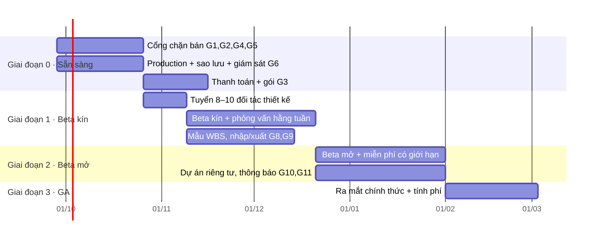

# Kế hoạch Go-To-Market (GTM) — PMTool

Phiên bản 1 · 2026-09-20 · Đầu vào: [hành trình người dùng](hanh-trinh-nguoi-dung.md), [kiến trúc & bảo mật](kien-truc.md), [báo cáo kiểm thử](kiem-thu.md).

> **Đọc trước khi dùng.** Kế hoạch này dựa trên **những gì sản phẩm thực sự có** (đã kiểm chứng bằng test) và **các giả thuyết thị trường chưa được kiểm chứng** — chưa có khảo sát khách hàng, dữ liệu giá hay số liệu thị trường trong repo. Mọi con số về giá, mục tiêu và tỉ lệ chuyển đổi dưới đây là **giả thuyết cần hiệu chỉnh bằng dữ liệu từ giai đoạn beta**, không phải dự báo. Những gì cần bạn quyết định nằm ở [mục 10](#10-quyết-định-cần-bạn-chốt).

## 1. Định vị

**Một câu:** *Quản lý dự án chuẩn PMBOK cho đội nhóm Việt — nhanh như công cụ việc-cần-làm, chặt chẽ như một PMO.*

| Trụ cột | Bằng chứng trong sản phẩm | Khác biệt so với công cụ phổ thông |
|---|---|---|
| **Chặt chẽ theo PMBOK** | Điều lệ → Phạm vi → WBS (4 cấp, mã tự sinh) → Từ điển WBS → Hoạt động → Giao phẩm/Mốc; **sơ đồ liên kết + kiểm tra độ phủ** trên dashboard; phê duyệt tách người soạn/người duyệt | Phần lớn công cụ công việc phổ thông không ép cấu trúc phạm vi; công cụ PMO nặng thì đắt và khó dùng |
| **Tiếng Việt là công dân hạng nhất** | Giao diện vi/en, tài liệu tiếng Việt, nhắc hạn theo giờ Việt Nam (8:00 ICT) | Thường chỉ dịch một phần |
| **Đội thực thi thực sự dùng** | Cập nhật nhanh tại danh sách, Telegram, nhiệm vụ ngày/tuần, điểm & nhân vật đồng hành | Giảm bệnh "PM nhập liệu, đội im lặng" |
| **An toàn cho nhiều bên** | Đa tenant, 5 vai trò + vai trò riêng theo dự án, ma trận quyền được test tự động | Có thể mời khách hàng xem mà không lo sửa nhầm |

**Không** định vị là "thay thế mọi thứ": chưa có nhập/xuất dữ liệu, đường găng, EVM, tích hợp lịch/lưu trữ (xem mục 4).

## 2. Khách hàng mục tiêu (giả thuyết — cần xác thực)

| Ưu tiên | Phân khúc | Vì sao hợp | Người mua / người dùng |
|---|---|---|---|
| **A** | Công ty dịch vụ/outsource phần mềm, agency, tư vấn 10–100 người chạy nhiều dự án cho khách | Cần phạm vi rõ, nghiệm thu giao phẩm, báo khách; đã quen PMBOK/Scrum | Giám đốc / PM |
| **A** | Đơn vị đào tạo & cộng đồng **PMP/PMBOK** (học viên cần công cụ thực hành có cấu trúc) | Kênh phân phối + nguồn người dùng có ý định cao | Giảng viên / học viên |
| **B** | Đội dự án nội bộ ở doanh nghiệp vừa (xây dựng, lắp đặt, sự kiện, chuyển đổi số) | Có mốc, giao phẩm, nghiệm thu | Trưởng dự án |
| **C** | Freelancer/nhóm nhỏ | Dễ vào (gói miễn phí) nhưng giá trị thương mại thấp | Cá nhân |

Bắt đầu với **A**: nỗi đau "khách hỏi đã xong chưa/đúng phạm vi chưa" khớp trực tiếp với sơ đồ liên kết + nghiệm thu.

## 3. Bối cảnh cạnh tranh (định tính — cần rà soát trước khi công bố)

| Nhóm | Ví dụ | Họ mạnh | PMTool thắng ở | PMTool thua ở |
|---|---|---|---|---|
| Công cụ công việc toàn cầu | Jira, Asana, ClickUp, Monday, Trello | Hệ sinh thái, tích hợp, độ phổ biến | Cấu trúc PMBOK sẵn có, tiếng Việt, nhắc qua Telegram | Tích hợp, ứng dụng di động, nhập/xuất, thương hiệu |
| Lập lịch chuyên sâu | MS Project, Primavera | Đường găng, tài nguyên, chi phí | Nhẹ, cộng tác web, giá | Chiều sâu lập lịch |
| Nền tảng nội địa/quản trị doanh nghiệp | Các nền tảng quản lý công việc Việt Nam, bộ ứng dụng văn phòng | Tiếng Việt, gần khách, gói tổng hợp | PMBOK rigor, đa tenant sạch, phân quyền | Bề rộng (nhân sự, chat, kho…) |

> **Việc cần làm:** lập bảng so sánh tính năng/giá có nguồn dẫn từ trang chính thức của từng đối thủ trước khi dùng trong tiếp thị (không đưa nhận định chưa kiểm chứng ra công khai).

## 4. Cổng sẵn sàng — phải xong trước khi mở đăng ký công khai

Rút từ rà soát hành trình và bảo mật. Kích cỡ: **S** ≤ 3 ngày, **M** ≈ 1–2 tuần, **L** > 2 tuần (một kỹ sư, ước lượng thô).

### 4.1 Chặn bán (bắt buộc)

| # | Hạng mục | Vì sao chặn | Cỡ |
|---|---|---|---|
| G1 | **Quên/đặt lại mật khẩu** + **xác minh email** | Mất mật khẩu = mất tài khoản; email giả | M |
| G2 | **Email giao dịch** (mời thành viên, nhắc, chào mừng) qua nhà cung cấp email; lời mời hiện chỉ có liên kết sao chép tay | Giảm đứt gãy J2, cần cho G1 | M |
| G3 | **Gói dịch vụ + thanh toán + giới hạn sử dụng** (số thành viên/dự án; hoá đơn; thuế VAT VN) | Không thu được tiền | L |
| G4 | **Điều khoản sử dụng, chính sách quyền riêng tư, xuất/xoá dữ liệu & đóng tài khoản** (tuân thủ Nghị định 13/2023 về dữ liệu cá nhân) | Pháp lý; niềm tin | M (+tư vấn pháp lý) |
| G5 | **Giới hạn tốc độ** cho đăng nhập/đăng ký/AI; khoá tạm khi đoán mật khẩu | Chống lạm dụng, chi phí AI | S |
| G6 | **Triển khai production**: môi trường, HTTPS/tên miền, biến môi trường bí mật, **sao lưu tự động + diễn tập khôi phục**, giám sát lỗi/hiệu năng/uptime, cảnh báo | Chưa có bằng chứng vận hành; **từng mất dữ liệu dev do lệnh migrate** (bài học: không thao tác migrate trên DB thật; cần quy trình migrate production an toàn) | L |
| G7 | **Rà soát bảo mật độc lập** (pentest/checklist OWASP), đặc biệt Artifact HTML tự viết (iframe cách ly) và luồng phiên | Bán cho doanh nghiệp | M |

### 4.2 Cản trở tăng trưởng (nên xong trong beta)

| # | Hạng mục | Tác động | Cỡ |
|---|---|---|---|
| G8 | **Dự án mẫu / mẫu WBS** theo ngành (phần mềm, xây dựng, sự kiện) + checklist kích hoạt | Rút ngắn tới "aha" (J1) | M |
| G9 | **Nhập/xuất** CSV/Excel (công việc, WBS); xuất báo cáo PDF của dashboard/sơ đồ liên kết | Rào cản chuyển đổi; PM cần gửi khách | M |
| G10 | **Dự án riêng tư / khách chỉ thấy dự án của họ** | Bán cho công ty dịch vụ có nhiều khách (J9) | M |
| G11 | **Thông báo trong app + email** cho giao việc/bình luận/từ chối giao phẩm; màn "việc của tôi" xuyên dự án | Telegram không đủ (J4) | M |
| G12 | Công cụ **chuyển cấp WBS hàng loạt** cho dữ liệu cũ | Tránh "đầy cảnh báo" khi nhập kế hoạch có sẵn | S |
| G13 | Ràng buộc route AI theo dự án; soát quyền xoá công việc của người khác | Khép các điểm đã biết trong kien-truc.md §5 | S |

### 4.3 Khác biệt hoá thêm (sau GA, theo phản hồi)
Baseline + kiểm soát thay đổi phạm vi; đường găng; yêu cầu + ma trận truy vết; rủi ro ↔ WBS; EVM/chi phí cộng dồn; SSO; tích hợp Google Calendar/Drive; ứng dụng di động.

## 5. Mô hình giá (giả thuyết để thử)

| Gói | Đối tượng | Gợi ý giới hạn | Mục đích |
|---|---|---|---|
| **Miễn phí** | Nhóm nhỏ, học viên | ≤ 5 thành viên, ≤ 2 dự án, không AI hoặc AI giới hạn | Đưa vào dùng, kênh đào tạo |
| **Nhóm** | Đội 5–30 | Tính theo thành viên/tháng; đủ tính năng PMBOK, Telegram, AI hạn mức | Doanh thu chính |
| **Doanh nghiệp** | 30+ | Dự án riêng tư, nhật ký kiểm toán xuất được, SSO (khi có), hỗ trợ ưu tiên, hợp đồng | Giá trị/khách cao |

- Viewer **không tính phí** (khách hàng xem miễn phí là vòng lan truyền tự nhiên).
- **Mức giá cụ thể: chưa đặt** — cần phỏng vấn 10–15 khách tiềm năng (Van Westendorp/khảo sát đơn giản) trong beta. Chi phí biến đổi cần biết: AI (Anthropic), email, lưu trữ, hạ tầng.

## 6. Lộ trình ra thị trường

> Mốc ngày là **khung tham chiếu** giả định một đội nhỏ toàn thời gian; điều chỉnh theo nguồn lực thực (mục 10).

| Giai đoạn | Mục tiêu | Tiêu chí hoàn thành (cổng qua giai đoạn) |
|---|---|---|
| **0 · Sẵn sàng** (≈4–7 tuần) | Khép các mục chặn bán G1–G7 | Toàn bộ G1–G7 xong; khôi phục sao lưu đã diễn tập; pentest không còn lỗi mức cao |
| **1 · Beta kín** (≈6 tuần) | Học từ 8–10 nhóm thật (ưu tiên phân khúc A) | ≥ 60% nhóm đạt "kích hoạt" (mục 8); ≥ 5 nhóm dùng nghiệm thu giao phẩm; danh sách 10 vấn đề UX hàng đầu đã xử lý |
| **2 · Beta mở** (≈6 tuần) | Kiểm chứng tăng trưởng tự nhiên + kênh | Có kênh thu hút lặp lại được; retention tuần 4 đạt ngưỡng đặt ra từ beta kín; đã thử giá |
| **3 · GA** | Tính phí, mở rộng kênh | Thanh toán chạy thật; SLA hỗ trợ; quy trình sự cố |

## 7. Kênh & chiến thuật

| Kênh | Chiến thuật | Vì sao |
|---|---|---|
| **Đơn vị đào tạo/cộng đồng PMP** | Gói miễn phí cho lớp học, bộ **mẫu dự án theo chương PMBOK**, webinar "lập WBS + từ điển WBS trên PMTool" | Người dùng có ý định cao, tự lan truyền |
| **Nội dung (SEO/LinkedIn/Facebook group/Zalo)** | Bài thực hành: "WBS đúng chuẩn", "Quy tắc 100%", "Nghiệm thu giao phẩm"; tải mẫu WBS | Tận dụng tài liệu vi sẵn có; thu email |
| **Sản phẩm tự lan truyền** | Viewer miễn phí (khách hàng xem tiến độ), liên kết báo cáo/sơ đồ chia sẻ, bot Telegram | Mỗi dự án kéo thêm người xem |
| **Bán trực tiếp phân khúc A** | Demo 20 phút bằng dự án mẫu; kèm bảng độ phủ của chính kế hoạch khách | Người mua là giám đốc/PM |
| **Đối tác dịch vụ** | Tư vấn/PMO triển khai cho khách, hoa hồng | Mở rộng có kiểm soát |

## 8. Thông điệp theo persona

| Persona | Thông điệp | Bằng chứng để demo |
|---|---|---|
| Chủ/giám đốc | "Biết dự án có đúng phạm vi, đúng hạn và đã được nghiệm thu chưa — trong một màn hình." | Sơ đồ liên kết + độ phủ, giao phẩm đã duyệt |
| PM | "Lập WBS chuẩn PMBOK nhanh hơn bảng tính, và hệ thống chỉ ra chỗ thiếu." | Cảnh báo độ phủ, mã WBS tự sinh |
| Thành viên | "Cập nhật trong 2 chạm, nhắc đúng giờ qua Telegram, không spam." | Đổi trạng thái tại dòng, nhiệm vụ ngày |
| Khách hàng | "Xem tiến độ và nghiệm thu mà không cần học công cụ." | Viewer chỉ đọc |

## 9. Số đo thành công

**Định nghĩa kích hoạt (đề xuất):** trong 7 ngày đầu tổ chức có ≥ 1 dự án, ≥ 5 công việc, ≥ 2 thành viên đã tham gia, và ≥ 1 phần tử WBS có cấp **hoặc** ≥ 1 giao phẩm.

| Nhóm | Chỉ số | Cách đo |
|---|---|---|
| Thu hút | Đăng ký/tuần theo kênh | Tham số UTM khi đăng ký *(cần bổ sung sự kiện phân tích — hiện chưa có)* |
| Kích hoạt | % tổ chức đạt định nghĩa trên | Truy vấn dữ liệu sẵn có |
| Giá trị PMBOK | % dự án có Phạm vi đã duyệt; điểm độ phủ trung bình; số giao phẩm nghiệm thu | Từ bảng `project_scopes`, `scope-map`, `deliverables` |
| Giữ chân | Tổ chức còn hoạt động tuần 4/8; DAU/WAU | Nhật ký hoạt động |
| Doanh thu | Chuyển đổi miễn phí → trả phí; ARPA; churn | Sau khi có thanh toán |
| Chất lượng | Tỉ lệ lỗi 5xx, thời gian phản hồi p95, NPS, số ticket/tổ chức | Giám sát (G6) + khảo sát trong app |

Ngưỡng mục tiêu: **đặt sau beta kín** từ dữ liệu thực; không cam kết số liệu trước đó.

## 10. Quyết định cần bạn chốt

1. **Thị trường đầu tiên:** chỉ Việt Nam, hay song song thị trường nói tiếng Anh? (ảnh hưởng ngôn ngữ, thanh toán, pháp lý)
2. **Nguồn lực & ngân sách:** số kỹ sư/thời gian dành cho giai đoạn 0; có thuê tư vấn pháp lý, pentest, hạ tầng không?
3. **Mô hình kinh doanh:** SaaS đa tenant tự vận hành, hay có gói triển khai riêng/on-prem cho doanh nghiệp?
4. **Thanh toán:** cổng nào (thẻ quốc tế, chuyển khoản/QR nội địa, hoá đơn điện tử)?
5. **Phân khúc ưu tiên:** đồng ý bắt đầu với công ty dịch vụ/outsource + đơn vị đào tạo PMP (A)?
6. **Chính sách AI:** chi phí AI do ai chịu (gói/hạn mức), và dữ liệu khách có được gửi tới nhà cung cấp AI không (cần nêu rõ trong chính sách riêng tư)?

## 11. Rủi ro & giảm thiểu

| Rủi ro | Mức | Giảm thiểu |
|---|---|---|
| Ra mắt khi chưa có quên mật khẩu/sao lưu/thanh toán → mất niềm tin | Cao | Cổng giai đoạn 0 là điều kiện cứng |
| Mất dữ liệu khách do thao tác migrate/vận hành | Cao | Quy trình migrate production + sao lưu tự động + diễn tập khôi phục; cấm dùng DB thật làm shadow DB |
| Sản phẩm bị coi là "quá nặng PMBOK" với đội nhỏ | Trung bình | Mẫu dự án, chế độ đơn giản (WBS tuỳ chọn), thông điệp "chặt chẽ nhưng nhanh" |
| Đối thủ lớn sao chép cấu trúc PMBOK | Trung bình | Bám tiếng Việt, cộng đồng PMP, độ sâu (baseline, truy vết) |
| Chi phí AI vượt kiểm soát | Trung bình | Hạn mức theo gói, giới hạn tốc độ (G5) |
| Gamification gây "hoàn thành ảo" | Thấp–TB | Theo dõi chỉ số bất thường; cho tổ chức tắt bảng xếp hạng |
| Phụ thuộc một cá nhân (bus factor) | Trung bình | Tài liệu hệ thống (đã có), CI xanh, quy trình phát hành |

## 12. 30 – 60 – 90 ngày

| Mốc | Việc chính |
|---|---|
| **30 ngày** | G1, G2, G5 xong; môi trường production + HTTPS + giám sát cơ bản dựng xong; soạn điều khoản/quyền riêng tư (G4); chốt các quyết định mục 10; bắt đầu tuyển đối tác beta |
| **60 ngày** | G3 (thanh toán + gói), sao lưu/khôi phục diễn tập (G6), pentest (G7); bắt đầu beta kín; mẫu WBS đầu tiên (G8) |
| **90 ngày** | Xong vòng phản hồi beta kín; nhập/xuất (G9); kế hoạch giá dựa dữ liệu; quyết định vào beta mở |
