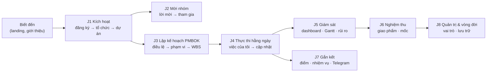
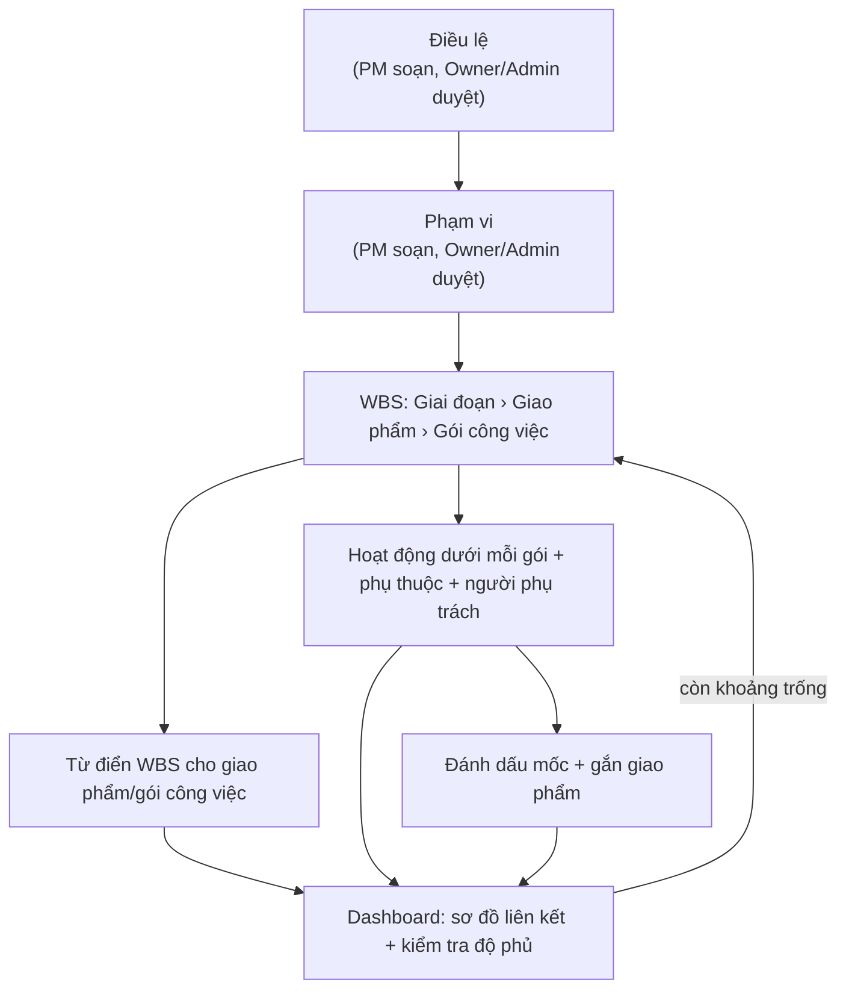
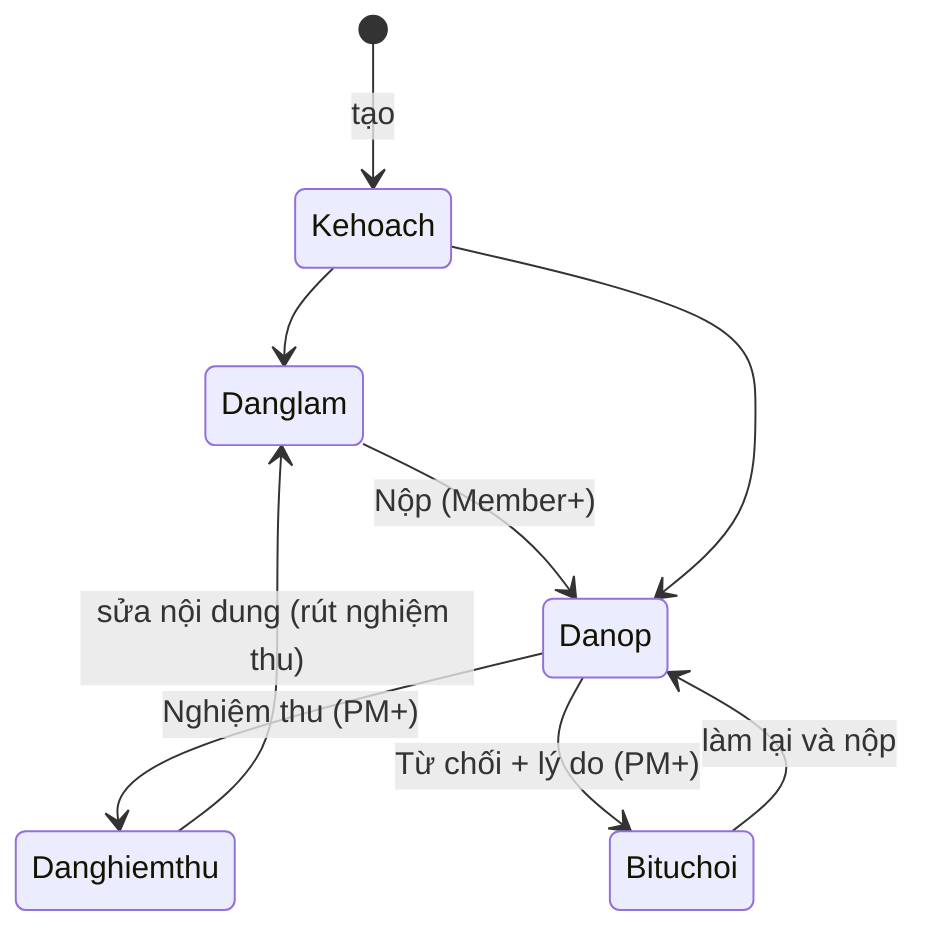

# Hành trình người dùng & luồng nghiệp vụ

Phân tích các hành trình (customer journey) và luồng nghiệp vụ của PMTool **theo những gì đã build tại 2026-09-20**. Mỗi hành trình nêu: mục tiêu, các bước, màn hình chạm tới, quy tắc nghiệp vụ hệ thống áp dụng, và **ma sát/khoảng trống** tìm thấy khi rà soát (đây là đầu vào cho [kế hoạch GTM](gtm.md)). Cách dùng từng màn hình xem [huong-dan-su-dung.md](huong-dan-su-dung.md); quyền chi tiết xem [kien-truc.md §2.4.1](kien-truc.md#241-ma-trận-phân-quyền-theo-vai-trò).

## 1. Chân dung người dùng (persona)

| Persona | Vai trò hệ thống | Muốn gì | Đo thành công bằng |
|---|---|---|---|
| **Chủ doanh nghiệp / trưởng bộ phận** ("Lan", người mua) | Owner | Có bức tranh tiến độ + rủi ro, tin rằng dự án đúng phạm vi và được nghiệm thu | Dashboard, sơ đồ liên kết PMBOK, giao phẩm được duyệt |
| **Quản lý dự án** ("Minh") | PM | Lập kế hoạch chặt chẽ theo PMBOK, giao việc, theo dõi trễ hạn, nghiệm thu | Thời gian lập kế hoạch, số việc trễ, độ phủ WBS |
| **Thành viên thực thi** ("Hà") | Member | Biết hôm nay làm gì, cập nhật nhanh, không bị làm phiền | Số bước để cập nhật một việc; nhắc hạn đúng lúc |
| **Bên liên quan / khách hàng** ("Bảo") | Viewer | Xem tiến độ và giao phẩm mà không sửa được gì | Vào là thấy ngay; không lo phá dữ liệu |
| **Quản trị tổ chức** | Admin | Quản lý người, vai trò, duyệt điều lệ/phạm vi | Mời/đổi quyền nhanh, an toàn |

## 2. Bản đồ hành trình tổng thể

## 3. Các hành trình chi tiết

### J1 — Kích hoạt: từ chưa có tài khoản đến công việc đầu tiên

**Mục tiêu:** trong vài phút người mới thấy giá trị ("aha"): có dự án, có công việc, thấy được bảng/Gantt.

| Bước | Màn hình | Điều xảy ra |
|---|---|---|
| 1. Đăng ký | `/register` | Họ tên, email, mật khẩu (argon2id). Tự đăng nhập, chuyển sang tạo tổ chức. |
| 2. Tạo tổ chức | `/onboarding/create-organization` | Tên + slug; người tạo là **Owner**. Hệ thống tạo sẵn không gian đa tenant. |
| 3. Tạo dự án | Danh sách dự án → "Tạo dự án" | Tên + mã (vd `WEB`) → mã công việc dạng `WEB-1`; có 3 cột Kanban mặc định (Việc cần làm · Đang thực hiện · Hoàn thành). |
| 4. Tạo công việc | Tab Công việc / WBS | Thêm việc, hoặc **tạo từ mô tả tự nhiên bằng AI** (người dùng xác nhận trước khi ghi). |
| 5. Thấy kết quả | Bảng, Tiến độ, Tổng quan | Kéo thả Kanban, Gantt hiện thanh, dashboard cập nhật. |

**Ma sát/khoảng trống:**
- ~~Không có dự án mẫu~~ → đã có **3 mẫu** (phần mềm, sự kiện, marketing; song ngữ) khi tạo dự án. *Cơ hội: thêm mẫu theo ngành (xây dựng, lắp đặt…) theo phản hồi.*
- ~~Không có hướng dẫn tương tác~~ → đã có thẻ **Bắt đầu nhanh** (5 bước, tính từ dữ liệu thật) trên Dashboard tổ chức.
- ~~Không có xác minh email / quên mật khẩu / email giao dịch~~ → đã có (cần cấu hình SMTP ở production).

### J2 — Mời đồng đội và tham gia

| Bước | Ai | Điều xảy ra |
|---|---|---|
| 1. Gửi lời mời | Owner/Admin ở Cài đặt tổ chức | Nhập email + vai trò (Admin/PM/Member/Viewer — **không thể mời Owner**). Tạo liên kết dùng một lần, hết hạn sau 7 ngày. Mời lại cùng email thay thế lời mời cũ. |
| 2. Chia sẻ liên kết | Người mời | **Sao chép liên kết và gửi thủ công** (chưa có email tự động). |
| 3. Mở liên kết | Người được mời | Chưa đăng nhập → chuyển sang đăng nhập/đăng ký rồi **quay lại đúng lời mời** (đã sửa lỗi mất lời mời). |
| 4. Chấp nhận | Người được mời | Email tài khoản phải khớp email được mời; vào tổ chức với vai trò đã chọn. |
| 5. Chọn nhân vật | Cài đặt | Chọn nhân vật đồng hành; nhân vật đã có người trong tổ chức bị làm mờ. |

**Quy tắc:** email đã là thành viên → từ chối; người mời không thể cấp Owner; Admin không thể hạ/xoá Owner; xoá thành viên dọn luôn vai trò riêng theo dự án của họ.

**Ma sát:** phải gửi liên kết bằng tay (dễ thất lạc, không nhắc lại); không mời hàng loạt; không có "yêu cầu tham gia".

### J3 — Lập kế hoạch dự án theo PMBOK (PM)

Đây là hành trình tạo khác biệt của PMTool. Chuỗi: **Điều lệ → Phạm vi → WBS → Từ điển WBS → Hoạt động → Mốc/Giao phẩm**.

**Quy tắc nghiệp vụ:**
- Cấp WBS: mục con phải thấp hơn cha; hoạt động là mức thấp nhất; thêm con vào một hoạt động → nó thành gói công việc.
- Mã WBS tự sinh theo thứ tự, không lưu.
- Sửa điều lệ/phạm vi **đã duyệt** → về Bản nháp, cần duyệt lại. Người soạn (PM) khác người duyệt (Owner/Admin).
- Mỗi công việc có **một người phụ trách** + nhiều người hỗ trợ; chỉ người phụ trách nhận thông báo Telegram và tính nhiệm vụ.
- Mốc phải có ngày đến hạn; ngày bắt đầu = ngày đến hạn.

**Ma sát/khoảng trống:**
- ~~Phải tự nhập tay từng phần tử WBS~~ → đã có **nhập/xuất CSV** (kiểm tra toàn bộ trước, lỗi theo dòng; nhận cột vi/en, dấu `,`/`;`). Chưa có nhập trực tiếp `.xlsx` hay MS Project.
- Công việc cũ được xếp cấp tự động nên báo nhiều cảnh báo độ phủ → đã có công cụ **đổi cấp WBS hàng loạt** (theo độ sâu có xem trước, hoặc chọn nhiều).
- Chưa có **đường găng (critical path)**, lập lịch tự động theo phụ thuộc, hay **đường cơ sở (baseline)** + kiểm soát thay đổi phạm vi.
- Chưa có Yêu cầu (requirements) và ma trận truy vết; chưa nối Rủi ro với phần tử WBS; chưa có chi phí cộng dồn (mới có ước tính trong từ điển).

### J4 — Thực thi hằng ngày (Member)

| Bước | Màn hình | Điều xảy ra |
|---|---|---|
| 1. Biết hôm nay làm gì | Nhắc Telegram 8:00; dashboard; **danh sách Công việc** (lọc "Của tôi", sắp xếp theo hạn) | Việc đến hạn hiện nhãn "trễ/hôm nay/sắp tới". |
| 2. Cập nhật nhanh | Danh sách: đổi trạng thái ngay trên dòng; chi tiết: ngày, % hoàn thành, mô tả, bình luận | Tự lưu, hiển thị "Đang lưu → Đã lưu". Phím `j/k` chuyển việc kế tiếp/trước. |
| 3. Cộng tác | Bình luận (Ctrl+Enter), người hỗ trợ, phụ thuộc | Lịch sử thay đổi ghi ai đổi gì. |
| 4. Hoàn thành | Đổi sang Hoàn thành | +điểm, cập nhật chuỗi ngày, huy hiệu; ghi nhật ký hoạt động. |

**Ma sát còn lại:** đã có **chuông thông báo trong app** và màn **Việc của tôi** xuyên dự án; chưa có email theo sự kiện, chưa có @mention, không có ứng dụng di động (web responsive).

### J5 — Giám sát và ra quyết định (PM/Owner)

| Nhu cầu | Nơi xem |
|---|---|
| Tôi có đang trễ không? | Dashboard tổ chức/dự án: tỉ lệ hoàn thành, việc quá hạn, rủi ro/vấn đề đang mở |
| Cái gì phụ thuộc cái gì? | Tiến độ (Gantt) với % hoàn thành trên thanh, thanh có người phụ trách, mốc hình thoi |
| Phạm vi có đủ và được phủ hết chưa? | **Sơ đồ liên kết PMBOK + Kiểm tra độ phủ** ở Tổng quan dự án |
| Rủi ro nào nguy hiểm nhất? | Rủi ro/Vấn đề, xếp theo điểm (khả năng × ảnh hưởng) |
| Ai đang làm gì gần đây? | Nhật ký hoạt động tổ chức |

**Khoảng trống:** không có báo cáo/ảnh chụp định kỳ gửi tự động, không xuất PDF/Excel, không EVM/ngân sách thực tế, không lọc theo giai đoạn trên dashboard.

### J6 — Nghiệm thu giao phẩm và mốc

**Quy tắc:** chỉ PM/Admin/Owner nghiệm thu, từ chối, **xoá**; từ chối bắt buộc lý do; sửa nội dung giao phẩm đã nộp/duyệt đưa nó về "Đang làm"; hệ thống lưu ai nghiệm thu và khi nào; mốc hiển thị "giao phẩm đã nghiệm thu / tổng" và nhãn "Trễ hạn".

**Ma sát:** không đính kèm file (chỉ đường dẫn); người nghiệm thu là PM — không có luồng **phê duyệt nhiều cấp** hay chữ ký của khách hàng bên ngoài (Viewer không thể duyệt); không thông báo cho người soạn khi bị từ chối (ngoài việc thấy trên màn hình).

### J7 — Vòng lặp gắn kết (gamification, Telegram, nhân vật)

- **Điểm + chuỗi ngày + huy hiệu + bảng xếp hạng** theo tổ chức; **4 nhiệm vụ** (việc đến hạn hôm nay/tuần, cập nhật tiến độ, đăng nhập) hiển thị trên dashboard và trang Bảng xếp hạng; chỉ người phụ trách được tính.
- **Telegram:** liên kết một lần (mã dùng một lần); nhận thông báo giao việc, nhắc hạn 8:00 ICT, bản tin cuối ngày (giờ tuỳ chỉnh).
- **Nhân vật đồng hành** theo dõi con trỏ; mỗi nhân vật thuộc một người trong cùng tổ chức, nhân vật đã bị chọn được làm mờ; nhân vật cũng xuất hiện trên Gantt (người phụ trách nổi bật, hỗ trợ nhỏ).

**Rủi ro thiết kế:** thi đua điểm có thể khuyến khích "hoàn thành ảo" — cần theo dõi chỉ số lạm dụng khi có khách thật; cho phép tổ chức tắt bảng xếp hạng.

### J8 — Quản trị và vòng đời tổ chức

| Tình huống | Luồng | Quy tắc |
|---|---|---|
| Đổi vai trò | Owner/Admin → Cài đặt → Thành viên | Admin không đổi/xoá được Owner; không thể hạ Owner cuối cùng. |
| Vai trò riêng theo dự án | Dự án → Cài đặt → Thành viên dự án | Thay thế vai trò tổ chức **trong dự án đó**, có thể nâng hoặc hạ; dữ liệu dự án khác không truy cập được qua URL của dự án này. |
| Nhân sự nghỉ việc | Xoá thành viên | Xoá cả vai trò riêng; công việc họ phụ trách vẫn còn (chưa có chuyển giao hàng loạt). |
| Tạm dừng tổ chức | Owner → Lưu trữ | Ẩn khỏi danh sách; chặn dự án/mời mới; vẫn cho rút người; khôi phục được. |
| Đóng tài khoản/xoá dữ liệu | — | **Chưa có** (cần cho GDPR/PDPD). |

### J9 — Bên liên quan chỉ xem (Viewer)

Được mời như thành viên vai trò Viewer: thấy mọi dự án của tổ chức ở chế độ **chỉ đọc** (giao diện ẩn nút sửa, có thông báo "chỉ có quyền xem"; API chặn mọi ghi). **Khoảng trống:** Viewer thấy **mọi** dự án trong tổ chức (chưa có dự án riêng tư/khách hàng chỉ thấy dự án của họ) — cần giải quyết trước khi bán cho công ty dịch vụ có nhiều khách.

## 4. Luồng nghiệp vụ liên chức năng (sự kiện → phản ứng)

| Sự kiện | Phản ứng của hệ thống |
|---|---|
| Tạo công việc | Ghi nhật ký; +điểm cho người tạo |
| Giao người phụ trách | Telegram cho người phụ trách mới; nhiệm vụ "đến hạn" tính cho họ |
| Đổi hạn | Xoá dấu "đã nhắc" để nhắc lại theo hạn mới; ghi lịch sử thay đổi |
| Cập nhật % hoàn thành | Nhiệm vụ "cập nhật tiến độ" +điểm (một lần/ngày) |
| Hoàn thành công việc | +điểm, cập nhật chuỗi/huy hiệu, vào nhật ký |
| Nộp/nghiệm thu giao phẩm | Đổi trạng thái, ghi người duyệt+thời điểm, cập nhật tiến độ mốc và sơ đồ |
| Sửa điều lệ/phạm vi đã duyệt | Về Bản nháp, xoá thông tin duyệt |
| Bất kỳ thay đổi công việc/giao phẩm/từ điển | Làm mới sơ đồ liên kết và độ phủ |

## 5. Tổng hợp khoảng trống theo mức độ (đầu vào cho GTM)

| Mức | Khoảng trống | Ảnh hưởng hành trình |
|---|---|---|
| 🔴 Chặn bán | Quên mật khẩu, xác minh email, email giao dịch (mời, nhắc) | J1, J2 |
| 🔴 Chặn bán | Không có thanh toán/gói dịch vụ/giới hạn sử dụng; không xoá tài khoản/dữ liệu; chưa có điều khoản/quyền riêng tư | J8, pháp lý |
| 🔴 Chặn bán | Không giới hạn tốc độ (đăng nhập/AI), không sao lưu/khôi phục được kiểm chứng, không giám sát lỗi | vận hành |
| 🟠 Cản trở tăng trưởng | Không nhập/xuất dữ liệu; không có mẫu dự án; không có dự án riêng tư cho khách | J1, J3, J9 |
| 🟠 Cản trở tăng trưởng | Thông báo chỉ Telegram; không thông báo trong app/email; không "việc của tôi" xuyên dự án | J4 |
| 🟡 Khác biệt hoá thêm | Baseline + kiểm soát thay đổi, đường găng, EVM, yêu cầu + truy vết, rủi ro ↔ WBS | J3, J5 |
| 🟡 Khác biệt hoá thêm | SSO, tích hợp Google Calendar/Drive, ứng dụng di động | mở rộng |
