# Kiến trúc PMTool

Tài liệu này mô tả kiến trúc tổng quan của PMTool ở 4 lớp: kiến trúc nghiệp vụ, kiến trúc hệ thống, tech stack, và các mối liên kết/luồng dữ liệu giữa các thành phần. Đối tượng đọc: kỹ sư tham gia dự án, hoặc người cần đánh giá kiến trúc kỹ thuật. Về cách dùng sản phẩm, xem [huong-dan-su-dung.md](huong-dan-su-dung.md); về cách chạy dự án, xem [README.md](../README.md).

Trạng thái tại thời điểm cập nhật (2026-09-20): Phase 1–3, Phase 4a (Điều lệ dự án, Các bên liên quan, Danh mục tài liệu), Artifact, Quản lý Tổ chức/Dự án, nhiệm vụ ngày/tuần, giao phẩm & mốc, và **khung phạm vi PMBOK** (Phạm vi, WBS, từ điển WBS, sơ đồ liên kết) đã triển khai trên nhánh `main`. Tài liệu phản ánh đúng những gì đã build, không phải kế hoạch. Các phần mới nằm ở [1.4](#14-khung-phạm-vi-pmbok), [2.4.1](#241-ma-trận-phân-quyền-theo-vai-trò), [4.5](#45-chuỗi-phạm-vi-pmbok--sơ-đồ-liên-kết) và [5](#5-bảo-mật--các-quy-tắc-đã-siết).

## Mục lục

1. [Kiến trúc nghiệp vụ](#1-kiến-trúc-nghiệp-vụ)
2. [Kiến trúc hệ thống](#2-kiến-trúc-hệ-thống)
3. [Tech stack](#3-tech-stack)
4. [Mối liên kết & luồng dữ liệu](#4-mối-liên-kết--luồng-dữ-liệu)
5. [Bảo mật & các quy tắc đã siết](#5-bảo-mật--các-quy-tắc-đã-siết)

---

## 1. Kiến trúc nghiệp vụ

### 1.1 Bản đồ năng lực nghiệp vụ (business capabilities)

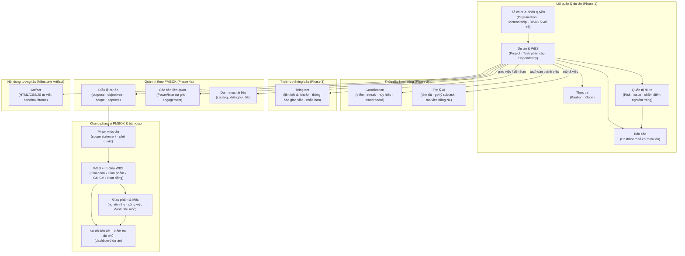

Ba nhóm năng lực được xây theo 3 phase, nhưng đều đặt trên cùng một lõi nghiệp vụ: **Tổ chức → Dự án → Công việc**. Gamification, AI và Telegram không phải module độc lập — chúng phản ứng lại các sự kiện xảy ra ở lõi (tạo việc, hoàn thành việc, giao việc), không có nghiệp vụ riêng. Nhóm quản trị PMBOK (Phase 4a) và Artifact thì ngược lại — là dữ liệu độc lập gắn trực tiếp vào dự án (không phát sinh từ sự kiện công việc), nên chỉ nhận cạnh từ C2 chứ không có cạnh phản hồi ngược lại như E1/E2/N1.

### 1.2 Mô hình miền dữ liệu (domain model)

```mermaid
erDiagram
    ORGANIZATION ||--o{ MEMBERSHIP : "thành viên (role)"
    USER ||--o{ MEMBERSHIP : "tham gia"
    ORGANIZATION ||--o{ PROJECT : "sở hữu"
    PROJECT ||--o{ PROJECT_MEMBER : "vai trò riêng (role override)"
    USER ||--o{ PROJECT_MEMBER : "được gán vai trò riêng"
    PROJECT ||--o{ TASK : "chứa"
    TASK ||--o{ TASK : "công việc con (parentTaskId) · phụ thuộc (TaskDependency)"
    USER }o--o{ TASK : "phụ trách (TaskAssignee)"
    TASK ||--o{ COMMENT : "bình luận"
    PROJECT ||--o{ BOARD_COLUMN : "cột Kanban"
    PROJECT ||--o{ RISK_ISSUE : "rủi ro/vấn đề"
    ORGANIZATION ||--o{ ACTIVITY_LOG : "nhật ký hoạt động"
    ORGANIZATION ||--o{ USER_SCORE : "điểm theo tổ chức"
    USER ||--o{ USER_SCORE : "có điểm"
    USER ||--o{ TELEGRAM_LINK_CODE : "mã liên kết (không có organizationId)"
    PROJECT ||--o| PROJECT_CHARTER : "điều lệ (1 dự án - 1 điều lệ)"
    USER ||--o{ PROJECT_CHARTER : "quản lý / phê duyệt"
    PROJECT ||--o{ STAKEHOLDER : "các bên liên quan"
    USER ||--o{ STAKEHOLDER : "liên kết (tuỳ chọn, có thể là bên ngoài)"
    PROJECT ||--o{ PROJECT_DOCUMENT : "danh mục tài liệu"
    PROJECT ||--o{ ARTIFACT : "trang HTML/CSS/JS tự viết"
    PROJECT ||--o| PROJECT_SCOPE : "phạm vi (1 dự án - 1 bản)"
    TASK ||--o| WBS_DICTIONARY_ENTRY : "từ điển WBS (1-1)"
    PROJECT ||--o{ DELIVERABLE : "giao phẩm"
    TASK ||--o{ DELIVERABLE : "gắn với công việc/mốc (tuỳ chọn)"
    USER ||--o{ USER_QUEST_PROGRESS : "nhiệm vụ ngày/tuần"

    ORGANIZATION { string slug string status "ACTIVE|ARCHIVED" }
    USER { string email "telegramChatId?" }
    PROJECT { string key "WEB, PMT, ..." string status }
    PROJECT_MEMBER { string role "OrgRole — override, không phải bản sao" }
    TASK { string humanKey "WEB-1" string status string priority date dueDate string nodeType "PHASE|DELIVERABLE|WORK_PACKAGE|ACTIVITY" bool isMilestone int percentComplete }
    RISK_ISSUE { int probability "1-5" int impact "1-5" int severity "= probability × impact" }
    USER_SCORE { int totalPoints int currentStreakDays }
    PROJECT_CHARTER { string status "DRAFT | APPROVED" string sponsorName }
    STAKEHOLDER { string fullName string influence "LOW|MEDIUM|HIGH" string interest "LOW|MEDIUM|HIGH" string currentEngagement string desiredEngagement }
    PROJECT_DOCUMENT { string category string version string status "DRAFT|IN_REVIEW|APPROVED|OBSOLETE" string url }
    ARTIFACT { string title string htmlContent "cap 200,000 chars" }
    PROJECT_SCOPE { string status "DRAFT | APPROVED" json inScope json outOfScope }
    WBS_DICTIONARY_ENTRY { json scopeDescription json acceptanceCriteria float costEstimate }
    DELIVERABLE { string status "PLANNED|IN_PROGRESS|SUBMITTED|ACCEPTED|REJECTED" string rejectionReason }
```

`Artifact.createdById` (như mọi `createdById` khác trong schema — `Project`, `Task`, `RiskIssue`, `ProjectCharter`, `Stakeholder`, `ProjectDocument`) là cột `String` thuần, không có quan hệ `@relation` — chỉ những trường mang ý nghĩa vai trò cụ thể (`ownerId`, `projectManagerId`, `approvedById`) mới có quan hệ thật tới `User`.

`ProjectMember` tồn tại từ Phase 1 nhưng **chỉ thật sự được đọc/ghi/kiểm tra quyền từ mốc Quản lý Tổ chức & Dự án** (trước đó chỉ ghi một lần lúc tạo dự án, không ai đọc lại) — xem [2.4](#24-hai-lớp-phân-quyền-tổ-chức-và-dự-án) để biết cách một dòng `ProjectMember` thay đổi quyền thật sự của một request.

`Task` tự tham chiếu chính nó theo **hai** quan hệ độc lập, gộp chung một cạnh trong sơ đồ trên cho gọn: `parentTaskId` (cây phân cấp WBS) và `TaskDependency` (predecessor/successor FS/SS/FF/SF, có kiểm tra chống vòng lặp khi tạo).

`TelegramLinkCode` là model **duy nhất không có `organizationId`** — nó gắn với `User`, không gắn với tổ chức, vì liên kết Telegram dùng chung cho mọi tổ chức một người dùng tham gia. Mọi model còn lại đều mang `organizationId` và nằm trong tập `TENANT_SCOPED_MODELS` được tự động lọc — xem [2.3](#23-đa-tenant-cách-ly-ở-tầng-ứng-dụng).

`Stakeholder.userId` là FK **tuỳ chọn** tới `User` — PMBOK stakeholder bao gồm cả người ngoài tổ chức (khách hàng, nhà cung cấp) không bao giờ có tài khoản PMTool, nên `fullName`/`role`/`organizationName`/`email`/`phone` luôn là cột dữ liệu thô, không phụ thuộc quan hệ này.

### 1.3 Vòng đời nghiệp vụ chính

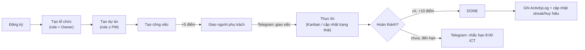

### 1.13 Hiệu năng

Xem [hieu-nang.md](hieu-nang.md). Điểm cần nhớ khi phát triển: (1) `GET projects/:key/tasks` **không** trả `description` (luôn `null`) — đọc mô tả ở `GET .../tasks/:id`; (2) danh sách công việc phía web vẽ theo đợt (`tree-rows.ts`, `task-tree.tsx`) nên đừng giả định mọi dòng đã có trong DOM; (3) thêm khoá ngoại mà truy vấn sẽ lọc theo thì **thêm chỉ mục** (Prisma không tự tạo cho Postgres); (4) không nhúng tài nguyên từ CDN bên thứ ba — tự phục vụ (E2E `performance.spec.ts` kiểm tra).

### 1.12 Báo cáo ngày

`project_daily_snapshots` (tenant-scoped, duy nhất theo `(projectId, date)`, `date` là ngày lịch giờ Việt Nam): ảnh chụp cuối ngày của dự án (số việc theo trạng thái, quá hạn, tiến độ trung bình, rủi ro/vấn đề mở, giao phẩm/mốc, tải sprint, số việc tạo/xong trong ngày, số thay đổi và số người hoạt động). Để biết "việc xong vào ngày nào" thêm `tasks.completedAt` (ghi khi chuyển sang DONE, xoá khi mở lại; dữ liệu cũ điền từ `updatedAt`). `ReportsScheduler`: **23:55 giờ VN** chốt mọi dự án chưa lưu trữ (`snapshotAll`, idempotent bằng upsert); **mỗi giờ phút :10 từ 08:00** gửi thông báo `DAILY_REPORT` cho ngày đã kết thúc (`notifyPending`) — mỗi dòng ảnh chụp chỉ gửi một lần (`notifiedAt`), nên tự bù khi máy chủ tắt lúc 08:00. Người nhận: OWNER/ADMIN của tổ chức, PM của tổ chức (trừ khi bị hạ vai trò ở dự án hoặc dự án riêng tư) và thành viên dự án vai trò OWNER/ADMIN/PM. Hôm nay được tính trực tiếp khi có yêu cầu (`GET projects/:key/reports/daily?date=&compareTo=`) và upsert, ngày cũ chỉ đọc bản đã chốt; ngày không có bản chốt trả `current: null` thay vì tính lại từ trạng thái hiện tại (sẽ sai). Phần thuần (diff, ngày, điều kiện gửi, payload) ở `report-math.ts`. Múi giờ cố định UTC+7 như các phần khác.

### 1.11 Dự án riêng tư

`projects.isPrivate`. Một dự án riêng tư chỉ tồn tại với OWNER/ADMIN của tổ chức và những người có dòng `project_members`. Thực thi ở **hai lớp**: (1) `ProjectGuard` trả 404 cho mọi route theo dự án; (2) các đọc xuyên dự án (danh sách dự án, dashboard tổ chức, "Việc của tôi", dòng hoạt động) loại các dự án ẩn qua `hiddenProjectIds()` (`common/project-visibility.ts`). `activity_logs.projectId` được thêm để lọc dòng hoạt động. Thêm một đọc xuyên dự án mới thì **bắt buộc** dùng `hiddenProjectIds`. Các route AI theo task đã được ràng buộc vào dự án của URL (`ProjectEntityGuard`).

### 1.10 Sprint (Scrum)

Lớp lập kế hoạch tuỳ chọn trên cùng bảng `tasks`: `projects.sprintsEnabled` + `estimationUnit` (POINTS|HOURS); `tasks.sprintId` (null = backlog, FK `ON DELETE SET NULL`) + `tasks.storyPoints`; bảng `sprints` (tenant-scoped) với chỉ mục duy nhất một phần `sprints_one_active_per_project` (`WHERE status='ACTIVE'`) để chặn hai sprint chạy cùng lúc ngay ở tầng dữ liệu. Khối lượng kế hoạch/đã xong được **tính khi đọc** từ các task (không lưu), chỉ `committedLoad` (lúc bắt đầu) và `completedLoad` (lúc đóng) được chụp lại để làm cơ sở cho tốc độ (velocity) và báo cáo sau này. Đóng sprint chuyển việc chưa xong trong một giao dịch. Gán việc vào sprint đã đóng hoặc thuộc dự án khác bị từ chối (`assertSprintUsable`). **Burndown:** `sprint_daily_snapshots` (tenant-scoped, duy nhất theo `(sprintId, date)`) lưu tổng khối lượng và phần đã xong cuối mỗi ngày; ghi khi **bắt đầu** sprint (ngày đầu), khi **đóng** (kết quả, trước khi việc dở bị chuyển đi), hằng đêm lúc 23:55 cùng tác vụ chốt báo cáo ngày (`SprintsService.snapshotActive`, gọi từ `ReportsScheduler`), và **trực tiếp** khi xem sprint đang chạy. `buildBurndown` (`burndown-math.ts`, hàm thuần có test) dựng chuỗi: đường lý tưởng giảm đều theo ngày lịch từ `committedLoad`; ngày thiếu bản chốt mang giá trị trước đó và đánh dấu `estimated`; sprint chạy quá hạn được vẽ tiếp; kết luận so với đường lý tưởng có dung sai 10% mức cam kết. `GET projects/:key/sprints/:id/burndown` (mọi vai trò xem được dự án). Module: `apps/api/src/modules/sprints`; giao diện: `apps/web/src/features/sprints`.

### 1.9 Kéo thả sắp xếp

Dùng HTML5 drag-and-drop gốc (không thêm thư viện) cho danh sách phẳng/cây; nút ↑↓←→ là đường đi bằng bàn phím. `planMove()` (`features/wbs/wbs-move.ts`, hàm thuần có unit test) đổi vị trí thả (trước/sau/vào trong) thành `{parentTaskId, orderIndex}`: `orderIndex` là số thực nằm giữa hai anh em (hoặc ±1 ở đầu/cuối), nên **không phải đánh số lại các mục khác**; từ chối thả vào chính nó/con cháu và các vị trí phá thứ bậc cấp WBS (trừ hoạt động nhận con → được nâng thành gói, khớp `placeChild` phía API). Gọi `PATCH tasks/:id/move` sẵn có (API kiểm tra lại toàn bộ và là nơi quyết định) với cập nhật lạc quan và hoàn tác khi lỗi (`useMoveTask`).

### 1.8 Đổi cấp WBS hàng loạt

`POST projects/:key/task-bulk/node-type` (`task-bulk.controller.ts`, logic thuần trong `wbs-bulk.ts` có unit test): hoặc `{taskIds, nodeType}` hoặc `{byDepth:true}`, thêm `dryRun`. `planBulk` tính cấp cuối cùng của **toàn bộ** cây rồi chỉ kiểm tra các cặp cha–con có ít nhất một bên đổi (dữ liệu cũ vốn đã sai ở chỗ khác không chặn thao tác). `levelsByDepth` gán lá = Hoạt động, mỗi cha = min(độ sâu, cấp thấp nhất của con − 1); nhánh sâu quá 4 cấp bị báo lỗi. Tất cả-hoặc-không, ghi bằng một `updateMany` mỗi cấp trong một transaction.

### 1.7 Thông báo trong ứng dụng

`NotificationsService.notify()` (module toàn cục) ghi một dòng `Notification` cho mỗi người nhận, đã loại người gây ra hành động và trùng lặp, và **không bao giờ ném lỗi** ra ngoài (thông báo hỏng không được làm hỏng việc giao/bình luận/nộp). Bản ghi chỉ lưu `type`, tên người gây ra, loại/ID/khoá dự án của đối tượng và một đoạn trích; **câu chữ được dựng ở client** theo ngôn ngữ người đọc. Được gọi từ `TasksService` (giao việc khi tạo/sửa — chỉ người mới được thêm), `CommentsService`, `DeliverablesService` (nộp → người duyệt: PM+/Admin/Owner theo vai trò tổ chức hoặc vai trò dự án; duyệt/từ chối → chủ và người tạo). Các service nhận `NotificationsService` qua `@Optional()` nên unit test cũ không đổi. Mọi truy vấn khoá theo `userId` người gọi. `GET organizations/:org/my-tasks` trả việc của người gọi xuyên dự án. Chuông poll 60 giây (chưa có WebSocket).

### 1.6 Nhập/xuất công việc bằng CSV

`TaskCsvService` (`modules/tasks`): `GET projects/:key/task-csv/export` và `POST …/task-csv/import {csv, dryRun}` (route riêng để không đụng `tasks/:taskId`). `csv.ts` là bộ đọc/ghi RFC 4180 tự viết (ngoặc kép, xuống dòng trong ô, BOM, tự nhận dấu `,`/`;`/tab); khi ghi, giá trị bắt đầu bằng `= + - @` được thêm `'` để chặn **CSV injection**, và khi đọc dấu `'` đó được gỡ ra nên dữ liệu khứ hồi không đổi. `task-import.ts` (hàm thuần, unit test) chuẩn hoá tên cột (không dấu, nhiều bí danh vi/en), giá trị enum (mã hoặc nhãn vi/en), ngày, người theo email trong tổ chức, sắp xếp cha trước con, phát hiện trùng `ref`/vòng lặp/cha không tồn tại, và áp quy tắc cấp WBS (giống `placeChild`). **Tất cả-hoặc-không**: `dryRun` trả xem trước + lỗi theo số dòng; ghi thật chỉ khi không có lỗi, trong một transaction, cấp `humanKey` liên tục bằng một lần tăng `taskSequence`. Nhập **không** đi qua `TasksService.create` nên không cộng điểm/không gửi Telegram. Giới hạn 2000 dòng, 1 MB; `main.ts` nâng giới hạn JSON body lên 2 MB.

### 1.5 Dự án mẫu và checklist kích hoạt

Danh mục mẫu (`packages/shared-types/src/templates/catalog.ts`) là **dữ liệu thuần, song ngữ vi/en**, dùng chung cho API và giao diện (giao diện vẽ danh sách chọn mẫu từ cùng dữ liệu). `planTemplate()` (`apps/api/src/modules/projects/template-plan.ts`, hàm thuần có unit test) xếp mẫu lên lịch: hoạt động nối tiếp trong gói công việc, gói trong giao phẩm, giao phẩm trong giai đoạn, giai đoạn nối tiếp nhau, chỉ dùng ngày làm việc, mốc ở cuối mỗi giai đoạn. `ProjectsService.create` ghi toàn bộ trong **cùng một transaction** với việc tạo dự án (phạm vi nháp, task theo thứ tự cha trước con với `humanKey` liên tục, từ điển WBS, bản ghi giao phẩm, rủi ro; `taskSequence` được đặt để việc mới nối tiếp) — lỗi giữa chừng thì không có dự án dở dang. Unit test bảo đảm mọi mẫu: đủ số phần tử, đúng thứ bậc, ngày làm việc, cha bao trọn con, và **không có cha nào chỉ một con** (để dự án mới không bị cảnh báo quy tắc 100%). `GET organizations/:org/dashboard/onboarding` tính checklist "Bắt đầu nhanh" từ số liệu thực (`DashboardService.onboarding`).

### 1.4 Khung phạm vi PMBOK

| Khái niệm PMBOK | Lưu ở đâu | Ghi chú thiết kế |
|---|---|---|
| Phạm vi dự án (Scope Statement) | `ProjectScope` (1 dự án - 1 bản) | Sửa bản đã duyệt → về `DRAFT`, giống `ProjectCharter`. |
| WBS | `Task` + `Task.nodeType` | Không có bảng WBS thứ hai: dùng chính cây `parentTaskId` để tái dùng Gantt, người phụ trách, phụ thuộc. |
| Mã WBS (1.2.3) | **suy ra**, không lưu | `computeWbsCodes()` trong `packages/shared-types` — không bao giờ lỗi thời sau khi kéo thả. |
| Từ điển WBS | `WbsDictionaryEntry` (1-1 với `Task`) | Mô tả phạm vi, tiêu chí nghiệm thu, giả định, ràng buộc, nguồn lực, chất lượng, chi phí. |
| Hoạt động | `Task` với `nodeType = ACTIVITY` | Phụ thuộc dùng `TaskDependency` sẵn có. |
| Giao phẩm | `Deliverable` (bản ghi nghiệm thu) gắn tuỳ chọn với 1 `Task` | Vòng đời PLANNED → IN_PROGRESS → SUBMITTED → ACCEPTED/REJECTED. |
| Mốc | `Task.isMilestone` | Không phải thực thể riêng; bắt buộc có hạn, ngày bắt đầu = hạn. |

Quy tắc thứ bậc (`apps/api/src/modules/tasks/wbs-rules.ts`): `PHASE > DELIVERABLE > WORK_PACKAGE > ACTIVITY`; mục con phải có cấp thấp hơn cha. Không chỉ định cấp thì mặc định `ACTIVITY`; thêm con vào một `ACTIVITY` sẽ nâng nó lên `WORK_PACKAGE` để các luồng "thêm việc con" cũ không bị chặn.

## 2. Kiến trúc hệ thống

### 2.1 Sơ đồ thành phần (component view)

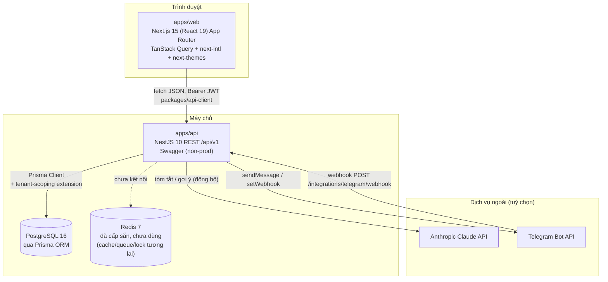

`Redis` đã có trong `docker-compose` và biến môi trường `REDIS_URL` nhưng **chưa được service nào kết nối tới** — cấp sẵn cho nhu cầu tương lai (cache, hàng đợi, distributed lock cho cron) chứ không phải đang dùng dở dang.

### 2.2 Bố cục monorepo

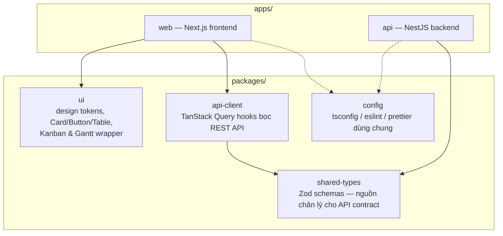

`packages/shared-types` là hợp đồng API duy nhất: một schema Zod được cả NestJS (DTO validation) và frontend (kiểu dữ liệu cho hook) cùng import — đổi hình dạng dữ liệu thì sửa ở đây trước, không sửa riêng từng phía rồi đồng bộ tay.

### 2.3 Đa tenant: cách ly ở tầng ứng dụng

Không dùng Postgres Row-Level Security (RLS) — cách ly được thực hiện hoàn toàn ở tầng ứng dụng qua một Prisma Client Extension, chạy cho **mọi** truy vấn của **mọi** model nằm trong `TENANT_SCOPED_MODELS`:

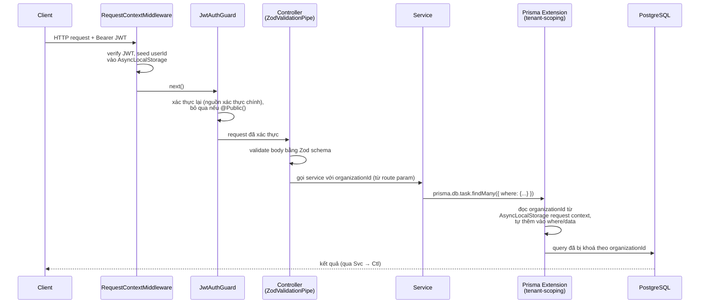

Vì việc thêm điều kiện lọc xảy ra ở tầng Prisma extension chứ không phải ở từng service, một service **không thể vô tình quên scope** — chỉ có nguy cơ duy nhất là quên đăng ký model mới vào `TENANT_SCOPED_MODELS` khi thêm bảng tenant-owned mới.

### 2.4 Hai lớp phân quyền: tổ chức và dự án

Từ mốc Quản lý Tổ chức & Dự án, quyền của một request trong phạm vi dự án không còn chỉ phụ thuộc vào `Membership.role` (vai trò cấp tổ chức) — một dòng `ProjectMember` (nếu có) cho đúng `(projectId, userId)` đó sẽ **thay thế hoàn toàn** vai trò tổ chức cho các request trong phạm vi dự án này:

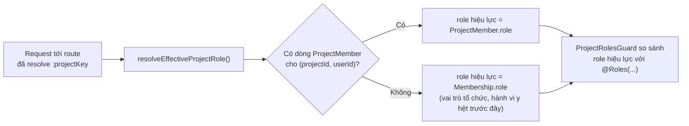

- **Mặc định không đổi**: một người dùng chưa từng được gán vai trò riêng có hành vi *y hệt* trước mốc này — `resolveEffectiveProjectRole()` (`apps/api/src/common/guards/project-role.util.ts`) chỉ trả về vai trò tổ chức khi không tìm thấy `ProjectMember`. Đây là lý do việc đổi `RolesGuard` → `ProjectRolesGuard` ở 9 controller cấp-dự-án (`tasks`, `dependencies`, `artifacts`, `charter`, `stakeholders`, `ai`, `boards`, `documents`, `risks`) không phá vỡ hành vi RBAC hiện có.
- **Vai trò riêng có thể nâng lên hoặc hạ xuống** so với vai trò tổ chức — không chỉ giới hạn ở việc hạn chế quyền.
- **Điều kiện hiển thị chỉ áp dụng cho dự án riêng tư** (xem §1.11): với dự án thường, xoá một `ProjectMember` không ẩn dự án khỏi người đó — khả năng nhìn thấy dựa trên tư cách thành viên tổ chức (`OrgMembershipGuard`); `ProjectMember` chỉ quyết định họ *làm được gì*. Với dự án **riêng tư**, có dòng `ProjectMember` là điều kiện để nhìn thấy (trừ OWNER/ADMIN), nên xoá dòng đó là thu hồi quyền truy cập.
- **Ngoại lệ tránh tự khoá bản thân**: quản lý chính danh sách `ProjectMember` của một dự án (`apps/api/src/modules/projects/project-members.controller.ts`) dùng `ProjectMemberManageGuard`, không phải `ProjectRolesGuard` — cho phép request khi **hoặc** vai trò tổ chức là OWNER/ADMIN, **hoặc** vai trò hiệu lực trên chính dự án đó là OWNER/ADMIN. Nếu chỉ dùng `ProjectRolesGuard` đơn thuần, một Owner/Admin tổ chức tự hạ vai trò riêng của mình trên một dự án sẽ tự khoá mình khỏi việc sửa lại chính danh sách đó.
- **`MembershipsService.removeMember` dọn luôn `ProjectMember`**: xoá một người khỏi tổ chức xoá theo mọi `ProjectMember` của họ trong tổ chức đó (cùng transaction) — nếu không, một người bị mời lại sau ở vai trò thấp hơn sẽ vô tình "hồi sinh" vai trò riêng cũ trên các dự án họ từng có, do `Membership` và `ProjectMember` là hai bảng độc lập không tự động đồng bộ.

#### 2.4.1 Ma trận phân quyền theo vai trò

Vai trò hiệu lực (xem trên) so với các nhóm `@Roles(...)`. Bảng dưới được **kiểm chứng tự động** bởi test tích hợp "Role-based access matrix" (`apps/api/test/integration/api.integration.spec.ts`): mỗi hành động được gọi thật với cả 5 vai trò và một người ngoài tổ chức.

| Hành động | Owner | Admin | PM | Member | Viewer |
|---|:-:|:-:|:-:|:-:|:-:|
| Xem mọi thứ trong tổ chức (dự án, công việc, phạm vi, hoạt động, thành viên) | ✓ | ✓ | ✓ | ✓ | ✓ |
| Tạo/sửa/xoá công việc, bình luận, phụ thuộc, cột Kanban | ✓ | ✓ | ✓ | ✓ | ✗ |
| Rủi ro/vấn đề, tài liệu, artifact | ✓ | ✓ | ✓ | ✓ | ✗ |
| Tạo/sửa giao phẩm, nộp giao phẩm, sửa từ điển WBS, dùng AI | ✓ | ✓ | ✓ | ✓ | ✗ |
| Sửa điều lệ, sửa phạm vi, bên liên quan | ✓ | ✓ | ✓ | ✗ | ✗ |
| Nghiệm thu / từ chối / **xoá** giao phẩm | ✓ | ✓ | ✓ | ✗ | ✗ |
| Tạo dự án, sửa dự án | ✓ | ✓ | ✓ | ✗ | ✗ |
| **Phê duyệt** điều lệ và phạm vi | ✓ | ✓ | ✗ | ✗ | ✗ |
| Mời/đổi vai trò/xoá thành viên, đổi tên tổ chức | ✓ | ✓ | ✗ | ✗ | ✗ |
| Lưu trữ / khôi phục tổ chức | ✓ | ✗ | ✗ | ✗ | ✗ |

Ghi chú: vai trò dự án (`ProjectMember`) thay thế vai trò tổ chức trong phạm vi dự án đó. Người ngoài tổ chức nhận `403` ở mọi route. Giao diện ẩn/vô hiệu hoá các nút mà vai trò hiện tại không làm được (`usePermissions`, `packages/shared-types/src/common/permissions.ts`), nhưng **API luôn là nơi quyết định** — ẩn nút chỉ là tiện lợi.

### 2.5 Đồ thị phụ thuộc module (backend)

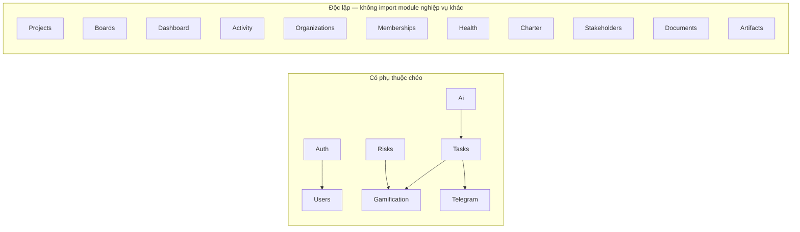

Quy tắc bất biến: `GamificationModule` và `TelegramModule` **không bao giờ import ngược lại `TasksModule`** dù có lý do hợp lý (vd. "xem việc đã giao") — tránh vòng lặp import. Cả hai chỉ đọc bảng `Task` trực tiếp qua `PrismaService` khi cần, không qua `TasksService`.

### 2.6 Xác thực & phiên đăng nhập

- Mật khẩu băm bằng **argon2id**.
- Đăng nhập trả về **access token** (JWT, 15 phút) + **refresh token** xoay vòng (cookie `httpOnly`, 30 ngày). Refresh token cũ bị đánh dấu revoked ngay khi dùng; tái sử dụng một refresh token đã revoked bị coi là dấu hiệu bị đánh cắp và thu hồi toàn bộ phiên của người dùng đó.
- **Đăng nhập bằng Google** (`google-auth.controller.ts`, `google-client.ts`, `google-auth.service.ts`): luồng OAuth 2.0 *authorization code* phía server. `GET auth/google/start` đặt cookie httpOnly ngắn hạn (10 phút) chứa `state` ngẫu nhiên + đích chuyển tiếp + ngôn ngữ rồi chuyển hướng tới Google; `GET auth/google/callback` chỉ chấp nhận khi `state` khớp cookie (chống giả mạo yêu cầu), đổi `code` lấy token bằng client secret rồi hỏi endpoint `userinfo` của Google (token đến thẳng từ Google qua TLS nên đáng tin), **bắt buộc `email_verified`**. Có tài khoản cùng email → dùng lại (và đánh dấu đã xác minh, không đụng mật khẩu); chưa có → tạo mới với mật khẩu ngẫu nhiên không ai biết và `hasPassword=false`. Sau đó đặt cookie refresh (như đăng nhập thường) và chuyển về web `/auth/google-done`, trang này đổi cookie lấy access token. Đường dẫn sau đăng nhập chỉ nhận đường dẫn tương đối (`/...`, không `//`, không URL đầy đủ) → không open-redirect; mọi lỗi đều về `/login?error=google` mà không tạo tài khoản. Bật khi có cả `GOOGLE_CLIENT_ID` và `GOOGLE_CLIENT_SECRET`, tắt thì endpoint trả 404 và web ẩn nút. `GoogleClient` là provider riêng nên test thay bằng bản giả. Xác nhận việc không thể hoàn tác (xoá tài khoản/tổ chức) dùng `assertIdentity`: mật khẩu, hoặc email gõ lại với tài khoản `hasPassword=false`.
- **Quên mật khẩu / xác minh email** dùng bảng `AuthToken` (`PASSWORD_RESET`, `EMAIL_VERIFY`): mã ngẫu nhiên 256-bit chỉ lưu **băm SHA-256**, có hạn (60 phút / 24 giờ), **dùng một lần** (đánh dấu `usedAt` bằng một câu `updateMany` có điều kiện nên hai request đồng thời không cùng dùng được), và phát hành mã mới vô hiệu mã cũ cùng loại. `POST auth/forgot-password` luôn trả `200` như nhau (không lộ email nào có tài khoản). Đặt lại mật khẩu thu hồi **toàn bộ refresh token** và đánh dấu email đã xác minh. Tài khoản có trước tính năng này được coi là đã xác minh (migration).
- **Email** đi qua `MailService` (SMTP qua nodemailer khi có `SMTP_HOST`; nếu không thì chỉ ghi log, và ở `NODE_ENV=test` giữ trong `outbox` để test đọc liên kết). Gửi lỗi không bao giờ làm hỏng request. Nội dung là mẫu vi/en (`mail-templates.ts`, có escape HTML).
- **Giới hạn tốc độ** (`@RateLimit` + `RateLimitGuard`, bộ đếm cửa sổ cố định trong bộ nhớ tiến trình — đủ cho một instance; nhiều instance cần thay bằng Redis) áp lên đăng ký, đăng nhập (theo IP+email và theo IP), làm mới phiên, quên/đặt lại mật khẩu, tạo tổ chức, AI, liên kết Telegram, nhận lời mời. `TRUST_PROXY` cho biết số reverse proxy để `req.ip` là IP thật. **Hạn mức chi phí**: `AiQuotaService` đếm lượt AI mỗi tổ chức mỗi ngày (bảng `ai_usage_daily`, `AI_DAILY_LIMIT_PER_ORG`), `MAX_ORGS_PER_USER` giới hạn số tổ chức một tài khoản sở hữu. `EmailVerifiedGuard` (bật bằng `EMAIL_VERIFICATION_REQUIRED=true`) chặn AI và gửi lời mời với tài khoản chưa xác minh.
- Lưu ý cấu hình: `ConfigService.get` trả **chuỗi thô từ `process.env`** khi biến đã được đặt (không phải giá trị đã ép kiểu của schema) và giá trị được kiểm tra một lần lúc import — đọc số bằng `Number(...)`, đọc cờ bằng so sánh chuỗi, và đặt biến cho test ở `vitest.integration.config.mts` (trước khi module nạp).
- `RequestContextMiddleware` best-effort giải mã JWT để seed tenant context sớm; `JwtAuthGuard` (global, qua `APP_GUARD`) mới là nơi thật sự từ chối request không hợp lệ — route nào cần bỏ qua thì đánh dấu `@Public()`.

### 2.7 Cách ly nội dung do người dùng viết (Artifact sandbox)

Tính năng Artifact (`apps/web/src/features/artifacts/artifact-editor.tsx`) là mẫu kiến trúc mới duy nhất cho phép người dùng chạy JS tuỳ ý trong app — cần một mô hình cách ly riêng, khác hẳn phần còn lại của hệ thống:

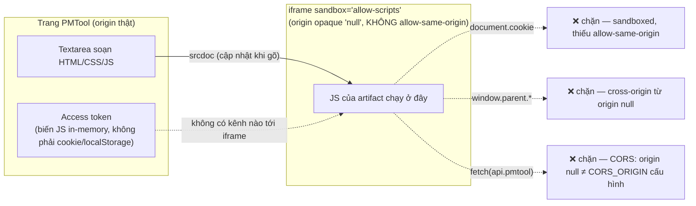

Ba lớp phòng thủ độc lập, đã kiểm chứng trực tiếp (không chỉ suy luận — xem `apps/web/e2e/artifact-embed.spec.ts` và một lần chạy thử thủ công gọi `document.cookie`/`window.parent.location`/`fetch()` từ bên trong artifact, cả ba đều bị chặn với lỗi rõ ràng):

1. **`sandbox="allow-scripts"` không có `allow-same-origin`** — iframe nhận một origin "opaque" (rỗng) duy nhất mỗi lần render, không phải origin thật của PMTool. Theo đặc tả trình duyệt, điều này tự động chặn truy cập `document.cookie`, `localStorage`, và DOM/JS của trang cha, bất kể nội dung tới từ `srcdoc` hay một URL thật.
2. **Access token không nằm trong cookie** — `packages/api-client/src/access-token-store.ts` giữ token trong một biến JS in-memory, gắn vào header `Authorization: Bearer` cho mỗi request. Artifact không có kênh nào (postMessage, DOM, storage) để lấy được biến này.
3. **CORS chặn ở lớp cuối** — `apps/api/src/main.ts` cấu hình `origin` là một chuỗi cố định (`CORS_ORIGIN`), không phải wildcard; một request `fetch()` từ origin `null` của iframe bị CORS từ chối dù có cố gắng gọi thẳng tới API.

**Quy tắc bất biến cho code review sau này**: không bao giờ thêm `allow-same-origin` vào iframe này, và không thêm listener `postMessage` trên trang chứa nó mà không kiểm tra `event.origin` — cả hai đều được ghi thành comment ngay tại `artifact-editor.tsx`, không chỉ ở tài liệu này.

## 3. Tech stack

| Lớp | Công nghệ | Vai trò |
|---|---|---|
| Frontend framework | Next.js 15 (React 19) (App Router) + TypeScript | SSR/CSR, routing theo `[locale]/[orgSlug]/...` |
| UI state/data | TanStack Query | cache + đồng bộ dữ liệu server, qua `packages/api-client` |
| Design system | Tailwind CSS + `packages/ui` | token màu vàng/xám, glass-morphism, sáng/tối |
| Đa ngôn ngữ | next-intl | vi/en, lưu qua cookie `NEXT_LOCALE` |
| Kanban | `@dnd-kit` | kéo-thả tự viết, không dùng thư viện Kanban trọn gói |
| Gantt | `@svar-ui/react-gantt` (MIT) | biểu đồ tiến độ |
| Backend framework | NestJS 10 | REST API `/api/v1`, versioning qua URI |
| Validation | Zod, per-route qua `ZodValidationPipe` | không có `ValidationPipe` toàn cục — mỗi route tự khai schema |
| ORM/DB | Prisma + PostgreSQL 16 | + Prisma Client Extension cho đa tenant |
| Auth | `@nestjs/jwt`, `@nestjs/passport`, argon2 | JWT + refresh token xoay vòng |
| Cron | `@nestjs/schedule` ^6.1.3 | nhắc hạn Telegram hằng ngày — **ghim ở bản 6.x**: bản 12.x ship dạng ESM-only (`"type": "module"`) và crash với `ERR_REQUIRE_ESM` khi app đã build (CJS) gọi `require()`, dù `tsc`/vitest vẫn pass bình thường |
| AI | Anthropic Claude API (native `fetch`, không SDK) | tóm tắt / gợi ý subtask / tạo việc từ NL |
| Thông báo | Telegram Bot API (native `fetch` + webhook) | liên kết tài khoản, thông báo, nhắc hạn |
| Kiểm thử | Vitest (unit) · Testcontainers + Supertest (integration) · Playwright (E2E) | 3 tầng, mỗi tầng một mục tiêu khác nhau |
| Build orchestration | Turborepo + pnpm workspaces | `turbo run build lint typecheck test` |
| CI | GitHub Actions | 3 job tuần tự: `checks` → `integration` → `e2e` |
| Hạ tầng dev | Docker Compose (Postgres 16 + Redis 7) | Redis cấp sẵn, chưa dùng |

## 4. Mối liên kết & luồng dữ liệu

### 4.1 Giao việc → điểm thưởng + thông báo Telegram

Đây là ví dụ điển hình cho cách các tính năng "vệ tinh" (gamification, Telegram) móc vào lõi nghiệp vụ: **gọi thẳng, đồng bộ, tường minh** — không qua event bus hay queue.

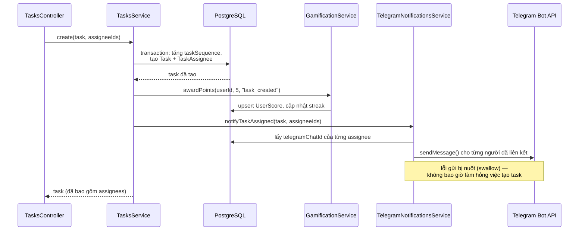

Điểm quan trọng: `TelegramNotificationsService.sendMessage` **không throw** khi lỗi — vì đây là side-effect nền của một hành động khác (tạo/giao việc), lỗi gửi thông báo không được phép làm hỏng thao tác chính. Ngược lại, các API trả kết quả trực tiếp cho người dùng (AI, tạo mã liên kết Telegram) thì throw lỗi rõ ràng khi chưa cấu hình — hai triết lý khác nhau cho hai loại lời gọi khác nhau, áp dụng nhất quán trong toàn bộ codebase.

### 4.2 Nhắc hạn công việc (cron hằng ngày)

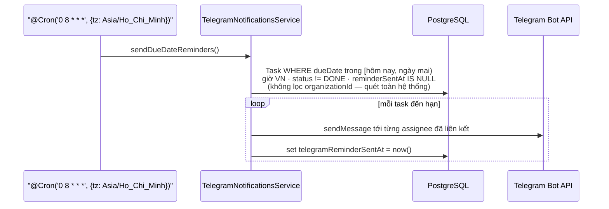

Vì cron job chạy ngoài một HTTP request, `AsyncLocalStorage` request context rỗng — Prisma extension tự động **không** áp bộ lọc tenant, cho phép quét đúng nghĩa toàn hệ thống. Đây là hành vi có chủ đích, không phải lỗ hổng: chỉ code chạy trong request pipeline mới bị/được tenant-scope.

### 4.3 Trợ lý AI — luôn là đề xuất, không bao giờ tự ghi

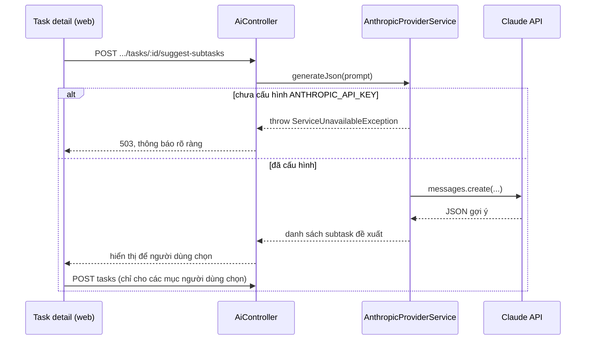

### 4.4 Pipeline CI

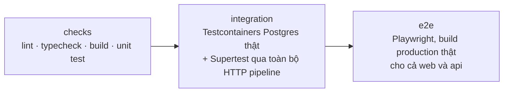

Mỗi job chạy trên một checkout + `pnpm install` độc lập — package nào được build ở job trước **không** mang sang job sau; job nào cần `packages/shared-types` đã build (không qua `next build`/`nest build`, vốn tự cascade qua `turbo`) phải tự build nó trước.

### 4.5 Chuỗi phạm vi PMBOK → sơ đồ liên kết

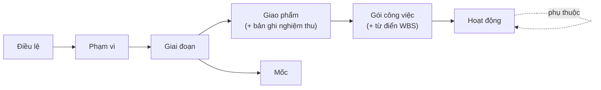

`GET /organizations/:org/projects/:key/scope-map` dựng đồ thị này ở server (`scope-map.builder.ts`, hàm thuần, có unit test) từ `Task`, `Deliverable`, `WbsDictionaryEntry`, `TaskDependency`, `ProjectCharter`, `ProjectScope`, và trả thêm **kiểm tra độ phủ**: gói công việc chưa có hoạt động/từ điển, giao phẩm chưa có tiêu chí hoặc bản ghi nghiệm thu, hoạt động không thuộc gói, mốc chưa gắn giao phẩm, mục cha chỉ có một con (quy tắc 100%). Frontend (`features/dashboard/scope-map*.tsx`) chỉ bố cục và vẽ SVG thuần (không thêm thư viện đồ thị); hoạt động được gộp thành bộ đếm cho đến khi mở ra. Khoá query của bản đồ nằm dưới tiền tố `tasks` nên mọi thay đổi công việc tự làm mới nó.

## 5. Bảo mật & các quy tắc đã siết

Kết quả rà soát phân quyền (2026-09-20) và các quy tắc đã đưa vào code + test:

| Vấn đề tìm thấy | Rủi ro | Đã xử lý |
|---|---|---|
| Admin có thể **hạ vai trò hoặc xoá Owner** (chỉ chặn khi là Owner cuối cùng) | Admin loại chủ sở hữu khỏi tổ chức | Chỉ Owner mới được đổi/xoá vai trò Owner (`MembershipsService.assertMayGrantOwner`); có unit + integration test. Vai trò Owner không thể cấp qua API (schema loại trừ). |
| Có thể gán **người ngoài tổ chức** làm người phụ trách/hỗ trợ, chủ giao phẩm, chủ rủi ro, quản lý điều lệ | Lộ tên/ảnh của người dùng tổ chức khác nếu đoán được id; dữ liệu sai | `assertOrgMembers()` (`common/guards/org-members.util.ts`) → `400`. |
| Member xoá được giao phẩm đã nghiệm thu | Xoá dấu vết nghiệm thu | Xoá giao phẩm chỉ PM trở lên. |
| Route AI theo task nhận `taskId` của dự án khác qua URL dự án A (đọc nội dung + tiêu hạn mức AI) | Rò nội dung công việc giữa các dự án | `ProjectEntityGuard` trên `summarize`/`suggest-subtasks`, chạy trước khi tính hạn mức; có integration test. |
| Sửa/xoá bản ghi của dự án B qua URL dự án A (rủi ro, tài liệu, bên liên quan, artifact, cột Kanban, công việc, phụ thuộc) — lợi dụng vai trò riêng trên A | Người chỉ là Viewer ở B nhưng là PM ở A có thể sửa dữ liệu B | `ProjectEntityGuard` + `@ProjectEntity(model, param)`: thực thể phải thuộc dự án trong URL, nếu không `404`. Có integration test. |
| Phạm vi do PM soạn cũng do PM phê duyệt | Không tách người soạn và người duyệt | Phê duyệt phạm vi chỉ Owner/Admin — giống điều lệ. |

### 5.1 Quyền riêng tư: xuất và xoá dữ liệu

`PrivacyService` (`modules/privacy`): `GET users/me/export` (dữ liệu của chính người dùng, không có băm mật khẩu), `GET organizations/:org/export` (Owner/Admin: dự án, công việc + người phụ trách, phụ thuộc, bình luận, rủi ro, điều lệ, phạm vi, tài liệu, giao phẩm, từ điển WBS, artifact, nhật ký), `DELETE users/me` (cần mật khẩu), `DELETE organizations/:org` (chỉ Owner, cần mật khẩu; một dòng `Organization` bị xoá kéo theo mọi bảng con nhờ cascade). Xoá tài khoản là **ẩn danh hoá** chứ không xoá dòng `User`: nhiều bản ghi của người khác trỏ tới người dùng (bình luận, nhật ký, chủ giao phẩm…) và ràng buộc khoá ngoại/cascade sẽ xoá lây nội dung chung. Trong một transaction: xoá tổ chức chỉ có người này; gỡ membership/project role/assignee; xoá điểm, huy hiệu, nhiệm vụ, mã Telegram, refresh/auth token; đổi email thành `deleted-<id>@deleted.invalid`, tên thành "Người dùng đã xoá", huỷ mật khẩu. Bị chặn (409) nếu người đó là Owner duy nhất của tổ chức còn người khác. Vai trò Owner giờ cấp được (`PATCH members/:id`), nhưng **chỉ Owner** làm được.

Các điểm đã biết, chưa xử lý (ghi nhận để quyết định trước GTM):
- Mọi thành viên tổ chức (kể cả Viewer) **đọc được mọi dự án** trong tổ chức; chưa có dự án riêng tư.
- Các route AI theo `taskId` (tóm tắt, gợi ý việc con) chưa ràng buộc công việc thuộc đúng dự án trong URL (chỉ đọc nội dung công việc cùng tổ chức, không ghi).
- Member xoá được công việc của người khác (nhóm nhỏ chấp nhận được; cần soát nếu bán cho tổ chức lớn).
- Không có giới hạn tốc độ (rate limit) cho đăng nhập/đăng ký và AI; chưa có xác thực 2 lớp, SSO, hay nhật ký kiểm toán xuất được.
