# Kiến trúc PMTool

Tài liệu này mô tả kiến trúc tổng quan của PMTool ở 4 lớp: kiến trúc nghiệp vụ, kiến trúc hệ thống, tech stack, và các mối liên kết/luồng dữ liệu giữa các thành phần. Đối tượng đọc: kỹ sư tham gia dự án, hoặc người cần đánh giá kiến trúc kỹ thuật. Về cách dùng sản phẩm, xem [huong-dan-su-dung.md](huong-dan-su-dung.md); về cách chạy dự án, xem [README.md](../README.md).

Trạng thái tại thời điểm viết (2026-09-17): Phase 1–3 và Phase 4a (Điều lệ dự án, Các bên liên quan, Danh mục tài liệu) đã triển khai và CI xanh trên nhánh `main`. Tài liệu phản ánh đúng những gì đã build, không phải kế hoạch.

## Mục lục

1. [Kiến trúc nghiệp vụ](#1-kiến-trúc-nghiệp-vụ)
2. [Kiến trúc hệ thống](#2-kiến-trúc-hệ-thống)
3. [Tech stack](#3-tech-stack)
4. [Mối liên kết & luồng dữ liệu](#4-mối-liên-kết--luồng-dữ-liệu)

---

## 1. Kiến trúc nghiệp vụ

### 1.1 Bản đồ năng lực nghiệp vụ (business capabilities)

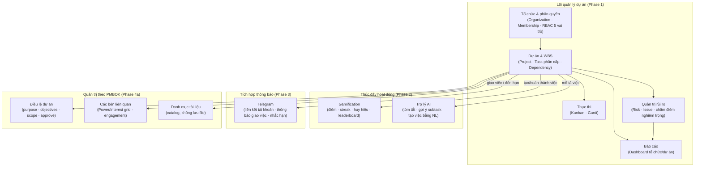

Ba nhóm năng lực được xây theo 3 phase, nhưng đều đặt trên cùng một lõi nghiệp vụ: **Tổ chức → Dự án → Công việc**. Gamification, AI và Telegram không phải module độc lập — chúng phản ứng lại các sự kiện xảy ra ở lõi (tạo việc, hoàn thành việc, giao việc), không có nghiệp vụ riêng. Nhóm quản trị PMBOK (Phase 4a) thì ngược lại — là dữ liệu độc lập gắn trực tiếp vào dự án (không phát sinh từ sự kiện công việc), nên chỉ nhận cạnh từ C2 chứ không có cạnh phản hồi ngược lại như E1/E2/N1.

### 1.2 Mô hình miền dữ liệu (domain model)

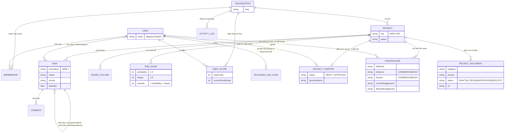

`Task` tự tham chiếu chính nó theo **hai** quan hệ độc lập, gộp chung một cạnh trong sơ đồ trên cho gọn: `parentTaskId` (cây phân cấp WBS) và `TaskDependency` (predecessor/successor FS/SS/FF/SF, có kiểm tra chống vòng lặp khi tạo).

`TelegramLinkCode` là model **duy nhất không có `organizationId`** — nó gắn với `User`, không gắn với tổ chức, vì liên kết Telegram dùng chung cho mọi tổ chức một người dùng tham gia. Mọi model còn lại đều mang `organizationId` và nằm trong tập `TENANT_SCOPED_MODELS` được tự động lọc — xem [2.3](#23-đa-tenant-cách-ly-ở-tầng-ứng-dụng).

`Stakeholder.userId` là FK **tuỳ chọn** tới `User` — PMBOK stakeholder bao gồm cả người ngoài tổ chức (khách hàng, nhà cung cấp) không bao giờ có tài khoản PMTool, nên `fullName`/`role`/`organizationName`/`email`/`phone` luôn là cột dữ liệu thô, không phụ thuộc quan hệ này.

### 1.3 Vòng đời nghiệp vụ chính

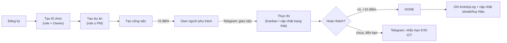

## 2. Kiến trúc hệ thống

### 2.1 Sơ đồ thành phần (component view)

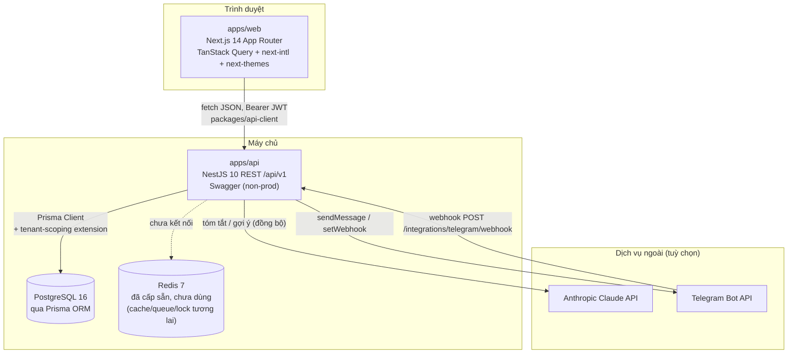

`Redis` đã có trong `docker-compose` và biến môi trường `REDIS_URL` nhưng **chưa được service nào kết nối tới** — cấp sẵn cho nhu cầu tương lai (cache, hàng đợi, distributed lock cho cron) chứ không phải đang dùng dở dang.

### 2.2 Bố cục monorepo

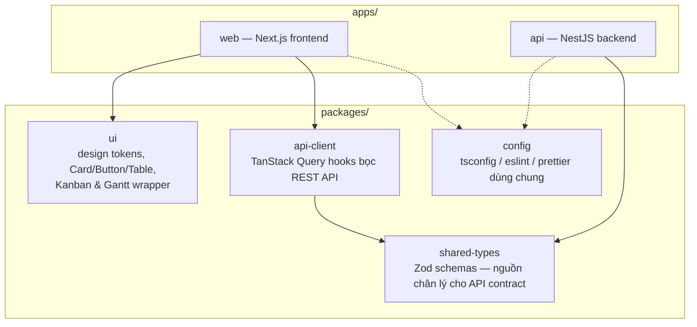

`packages/shared-types` là hợp đồng API duy nhất: một schema Zod được cả NestJS (DTO validation) và frontend (kiểu dữ liệu cho hook) cùng import — đổi hình dạng dữ liệu thì sửa ở đây trước, không sửa riêng từng phía rồi đồng bộ tay.

### 2.3 Đa tenant: cách ly ở tầng ứng dụng

Không dùng Postgres Row-Level Security (RLS) — cách ly được thực hiện hoàn toàn ở tầng ứng dụng qua một Prisma Client Extension, chạy cho **mọi** truy vấn của **mọi** model nằm trong `TENANT_SCOPED_MODELS`:

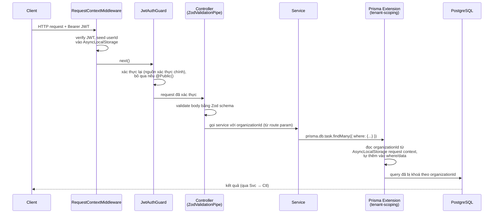

Vì việc thêm điều kiện lọc xảy ra ở tầng Prisma extension chứ không phải ở từng service, một service **không thể vô tình quên scope** — chỉ có nguy cơ duy nhất là quên đăng ký model mới vào `TENANT_SCOPED_MODELS` khi thêm bảng tenant-owned mới.

### 2.4 Đồ thị phụ thuộc module (backend)

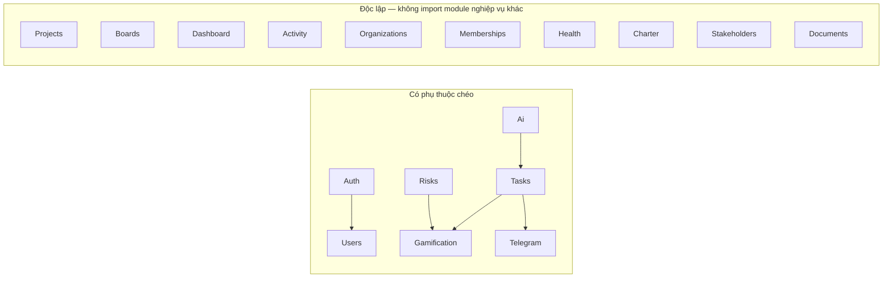

Quy tắc bất biến: `GamificationModule` và `TelegramModule` **không bao giờ import ngược lại `TasksModule`** dù có lý do hợp lý (vd. "xem việc đã giao") — tránh vòng lặp import. Cả hai chỉ đọc bảng `Task` trực tiếp qua `PrismaService` khi cần, không qua `TasksService`.

### 2.5 Xác thực & phiên đăng nhập

- Mật khẩu băm bằng **argon2id**.
- Đăng nhập trả về **access token** (JWT, 15 phút) + **refresh token** xoay vòng (cookie `httpOnly`, 30 ngày). Refresh token cũ bị đánh dấu revoked ngay khi dùng; tái sử dụng một refresh token đã revoked bị coi là dấu hiệu bị đánh cắp và thu hồi toàn bộ phiên của người dùng đó.
- `RequestContextMiddleware` best-effort giải mã JWT để seed tenant context sớm; `JwtAuthGuard` (global, qua `APP_GUARD`) mới là nơi thật sự từ chối request không hợp lệ — route nào cần bỏ qua thì đánh dấu `@Public()`.

## 3. Tech stack

| Lớp | Công nghệ | Vai trò |
|---|---|---|
| Frontend framework | Next.js 14 (App Router) + TypeScript | SSR/CSR, routing theo `[locale]/[orgSlug]/...` |
| UI state/data | TanStack Query | cache + đồng bộ dữ liệu server, qua `packages/api-client` |
| Design system | Tailwind CSS + `packages/ui` | token màu vàng/xám, glass-morphism, sáng/tối |
| Đa ngôn ngữ | next-intl | vi/en, lưu qua cookie `NEXT_LOCALE` |
| Kanban | `@dnd-kit` | kéo-thả tự viết, không dùng thư viện Kanban trọn gói |
| Gantt | `@svar-ui/react-gantt` (MIT) | biểu đồ tiến độ |
| Backend framework | NestJS 10 | REST API `/api/v1`, versioning qua URI |
| Validation | Zod, per-route qua `ZodValidationPipe` | không có `ValidationPipe` toàn cục — mỗi route tự khai schema |
| ORM/DB | Prisma + PostgreSQL 16 | + Prisma Client Extension cho đa tenant |
| Auth | `@nestjs/jwt`, `@nestjs/passport`, argon2 | JWT + refresh token xoay vòng |
| Cron | `@nestjs/schedule` ^6.1.3 | nhắc hạn Telegram hằng ngày — **ghim ở bản 6.x**: bản 12.x ship dạng ESM-only (`"type": "module"`) và crash với `ERR_REQUIRE_ESM` khi app đã build (CJS) gọi `require()`, dù `tsc`/vitest vẫn pass bình thường |
| AI | Anthropic Claude API (native `fetch`, không SDK) | tóm tắt / gợi ý subtask / tạo việc từ NL |
| Thông báo | Telegram Bot API (native `fetch` + webhook) | liên kết tài khoản, thông báo, nhắc hạn |
| Kiểm thử | Vitest (unit) · Testcontainers + Supertest (integration) · Playwright (E2E) | 3 tầng, mỗi tầng một mục tiêu khác nhau |
| Build orchestration | Turborepo + pnpm workspaces | `turbo run build lint typecheck test` |
| CI | GitHub Actions | 3 job tuần tự: `checks` → `integration` → `e2e` |
| Hạ tầng dev | Docker Compose (Postgres 16 + Redis 7) | Redis cấp sẵn, chưa dùng |

## 4. Mối liên kết & luồng dữ liệu

### 4.1 Giao việc → điểm thưởng + thông báo Telegram

Đây là ví dụ điển hình cho cách các tính năng "vệ tinh" (gamification, Telegram) móc vào lõi nghiệp vụ: **gọi thẳng, đồng bộ, tường minh** — không qua event bus hay queue.

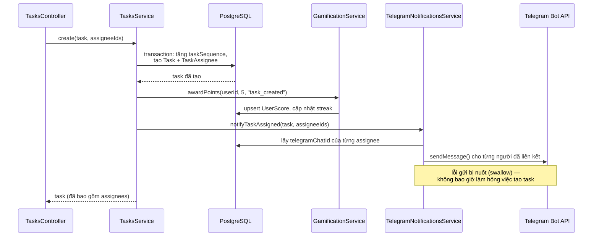

Điểm quan trọng: `TelegramNotificationsService.sendMessage` **không throw** khi lỗi — vì đây là side-effect nền của một hành động khác (tạo/giao việc), lỗi gửi thông báo không được phép làm hỏng thao tác chính. Ngược lại, các API trả kết quả trực tiếp cho người dùng (AI, tạo mã liên kết Telegram) thì throw lỗi rõ ràng khi chưa cấu hình — hai triết lý khác nhau cho hai loại lời gọi khác nhau, áp dụng nhất quán trong toàn bộ codebase.

### 4.2 Nhắc hạn công việc (cron hằng ngày)

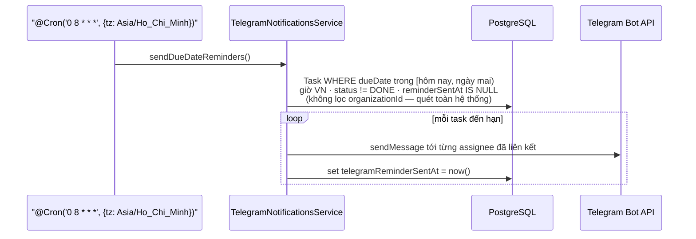

Vì cron job chạy ngoài một HTTP request, `AsyncLocalStorage` request context rỗng — Prisma extension tự động **không** áp bộ lọc tenant, cho phép quét đúng nghĩa toàn hệ thống. Đây là hành vi có chủ đích, không phải lỗ hổng: chỉ code chạy trong request pipeline mới bị/được tenant-scope.

### 4.3 Trợ lý AI — luôn là đề xuất, không bao giờ tự ghi

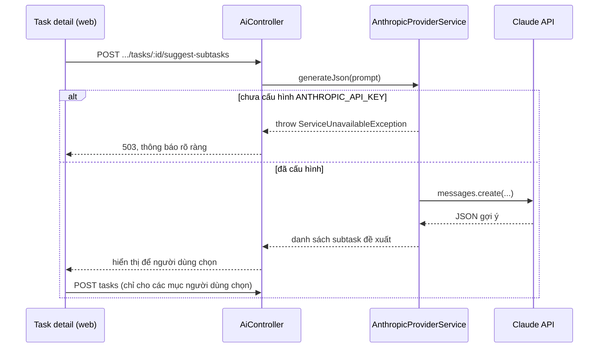

### 4.4 Pipeline CI

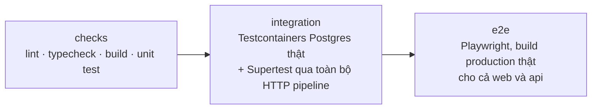

Mỗi job chạy trên một checkout + `pnpm install` độc lập — package nào được build ở job trước **không** mang sang job sau; job nào cần `packages/shared-types` đã build (không qua `next build`/`nest build`, vốn tự cascade qua `turbo`) phải tự build nó trước.
